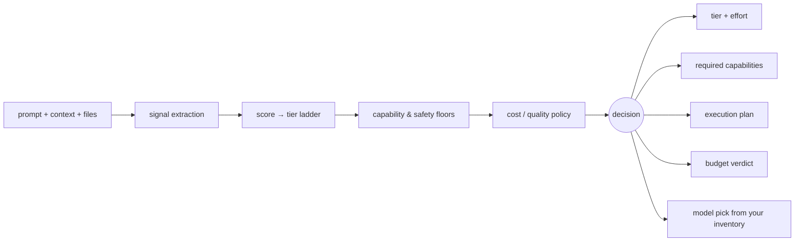

[](https://www.npmjs.com/package/switchboard-mcp)
[](https://nodejs.org)
[](LICENSE)

# Switchboard

**Switchboard is a pre-flight check for AI requests.** Before your agent calls a model, it answers:
what capabilities does this task actually need, what is the minimum safe quality tier, how many
stages should this take, does it fit my budget, and which model in my inventory qualifies. It runs
entirely on your machine, needs no API key, and never sees your prompt leave the process.

> Switchboard is **advisory**. Your host decides whether to call it, whether to follow it, and which
> model to actually invoke.

**What is measured, and what is not.** The capability detection, safety floors, budget arithmetic and
model filtering are deterministic and covered by tests — those are the parts to rely on. The *tier*
and *effort* suggestions are keyword heuristics, and on a public academic benchmark they are **not
distinguishable from a random router at matched cost**. Read
[the evaluation](benchmarks/README.md) before treating a tier as a quality claim. That measurement is
Switchboard's own, and it is reproducible with one command.

## Use cases

Things a user says, and what Switchboard answers underneath:

- `"Here's a 200-page PDF — what are the risks?"` → needs `files` + `longContext`, floor of `deep`
- `"Audit this auth flow for race conditions"` → needs `code`, high-stakes floor, 3-stage plan
- `"What changed in the EU AI Act this month?"` → needs `web`, recency signal
- `"Which of these three models should I use, under $0.01?"` → ranked inventory + budget verdict
- `"Make this email friendlier"` → no special capabilities, single stage

The first four are the load-bearing ones: each turns on a requirement the request genuinely implies,
not on a guess about how hard it is.

## Requirements

- **Node.js 22+**. That is the entire list.
- No API key. No account. No model download. No GPU. No network egress at runtime.

## Install

```bash
npx switchboard-mcp --transport=stdio
```

<details open>
<summary><b>Claude Code</b></summary>

```bash
claude mcp add switchboard -- npx -y switchboard-mcp --transport=stdio
```
</details>

<details>
<summary><b>Claude Desktop</b> — <code>claude_desktop_config.json</code></summary>

```json
{
  "mcpServers": {
    "switchboard": {
      "command": "npx",
      "args": ["-y", "switchboard-mcp", "--transport=stdio"]
    }
  }
}
```

On Windows, wrap the launcher: `"command": "cmd"`, `"args": ["/c", "npx", "-y", "switchboard-mcp", "--transport=stdio"]`.
</details>

<details>
<summary><b>VS Code</b> — <code>.vscode/mcp.json</code> (note: <code>servers</code>, not <code>mcpServers</code>)</summary>

```json
{
  "servers": {
    "switchboard": {
      "type": "stdio",
      "command": "npx",
      "args": ["-y", "switchboard-mcp", "--transport=stdio"]
    }
  }
}
```
</details>

<details>
<summary><b>Cursor</b> — <code>~/.cursor/mcp.json</code></summary>

```json
{
  "mcpServers": {
    "switchboard": {
      "command": "npx",
      "args": ["-y", "switchboard-mcp", "--transport=stdio"]
    }
  }
}
```
</details>

Verify it works without wiring up a client:

```bash
npx -y @modelcontextprotocol/inspector --cli npx switchboard-mcp --method tools/list
```

## How it works



Floors are applied after the policy shift, so no cost policy can route beneath a safety or
capability requirement.

## Tools

| Tool | Purpose | Mutates state |
|---|---|---|
| `route_request` | Route and plan one request | no |
| `prepare_request` | Run the configurable preflight pipeline: routing, file-to-Markdown conversion, prompt compression, reply-brevity steering | no |
| `explain_route` | Concise explanation plus structured evidence | no |
| `compare_routes` | Compare 2–8 policy or profile variants | no |
| `simulate_policy` | Simulate variants without changing state | no |
| `validate_model_inventory` | Validate a provider-independent model inventory | no |
| `evaluate_router` | Evaluate 1–100 labeled routing cases | no |
| `record_override` | Record category-only upgrade/downgrade feedback | **yes** |
| `get_preference_state` | Read aggregate preference counters and weights | no |
| `reset_preference_state` | Delete aggregate preference state | **yes** |

Every tool publishes a bounded JSON Schema 2020-12 input **and** output contract, and returns
`structuredContent` conforming to it.

### `route_request`

| Parameter | Type | Required | Default | Notes |
|---|---|---|---|---|
| `prompt` | string | yes | — | 1–64,000 chars. Never stored or logged. |
| `context` | array | no | `[]` | Up to 8 recent turns, 32,000 chars total |
| `files` | array | no | `[]` | Up to 20 attachment descriptors (metadata only) |
| `policy` | enum | no | `balanced` | `best` \| `balanced` \| `fast` \| `conserve` |
| `profile` | enum | no | `general` | See profiles below |
| `planMode` | enum | no | `auto` | `auto` \| `single` \| `multi` |
| `budget` | object | no | — | `maxRelativeCost`, `maxRelativeLatency`, `minQuality`, `maxStages` |
| `availableModels` | array | no | — | Your inventory; omit to get a tier recommendation only |
| `currentModelId` | string | no | — | Requires `availableModels` |
| `categoryBoosts` | object | no | `{}` | Per-category score nudges |

<details>
<summary>The other nine tools</summary>

`prepare_request` takes the same input as `route_request` plus `features` (independent `routing`,
`fileToMarkdown`, `compression`, `brevity` toggles, all local), `attachments`, and `compression`/
`brevity` options, and returns the routed decision alongside a per-stage report and the prepared
prompt text. `explain_route` takes the same input as `route_request` and returns prose plus
evidence. `compare_routes` and `simulate_policy` take `{ prompt, variants: [{ label, arguments }] }`
with 2–8 variants. `validate_model_inventory` takes `{ models }`. `evaluate_router` takes
`{ cases: [{ id, prompt, expectedTier }], includePreferences? }`. `record_override` takes
`{ categories, recommendedTier, selectedTier }` and nothing else. `get_preference_state` and
`reset_preference_state` take no arguments. Full schemas: [docs/mcp.md](docs/mcp.md).
</details>

### Example

Request:

```json
{
  "prompt": "Audit this authentication flow and verify subtle failure modes.",
  "profile": "security",
  "policy": "balanced",
  "planMode": "multi",
  "budget": { "maxRelativeCost": 0.8, "minQuality": 0.7, "maxStages": 3 },
  "availableModels": [
    { "id": "deep-code", "tier": "deep", "effortLevels": ["high"],
      "capabilities": { "code": true }, "relativeCost": 0.5, "relativeLatency": 0.5 }
  ]
}
```

Response (abridged):

```json
{
  "tier": "deep",
  "effort": "high",
  "capabilities": { "web": false, "files": false, "vision": false, "longContext": false, "code": true },
  "confidence": 0.875,
  "shouldUseJudge": false,
  "reasons": [
    { "code": "deep-reasoning", "detail": "The request explicitly asks for rigorous verification or analysis.", "weight": 2.2 },
    { "code": "high-stakes-domain", "detail": "The task appears to involve a domain where subtle errors can matter.", "weight": 1.35 },
    { "code": "complex-code-floor", "detail": "Code combined with architecture or high-stakes review requires deep reasoning.", "weight": 1.2 }
  ],
  "taskCategories": ["reasoning", "code", "high-stakes"],
  "executionPlan": { "mode": "multi", "stages": [{ "id": "analyze" }, { "id": "refine" }, { "id": "verify" }] },
  "budgetAssessment": { "fits": true, "violations": [], "estimatedRelativeCost": 0.5, "estimatedQuality": 1 },
  "modelResolution": {
    "status": "recommended",
    "recommended": { "id": "deep-code", "tier": "deep", "effort": "high", "meetsRequirements": true }
  }
}
```

`modelResolution.status` is `recommended` only when the model actually meets the routed tier, effort
and capabilities; it is `best-effort` when the closest candidate falls short, and
`no-compatible-model` when nothing qualifies.

## Profiles

`general`, `coding`, `legal`, `research`, `creative`, `security`, `finance`, `medical`, `low-cost`,
`low-latency`.

A profile may raise a tier or capability floor. It can never lower a deterministic safety
requirement.

## When to use it — and when not to

**Use it when** your host can choose among models or reasoning levels, cost and latency actually
vary across that choice, and requests differ in difficulty.

**Skip it when** your host pins one model, only one model is available, or every request is
essentially the same shape. A router with nothing to choose between is overhead.

## Configuration

| Setting | Flag | Environment variable | Default |
|---|---|---|---|
| Transport | `--transport` | — | `stdio` |
| Bind host | `--host` | — | `127.0.0.1` |
| Port | `--port` | — | `3764` |
| Endpoint path | `--path` | — | `/mcp` |
| Session TTL (ms) | `--session-ttl-ms` | — | `1800000` |
| Max sessions | `--max-sessions` | — | `256` |
| Bearer token | `--token` | `SWITCHBOARD_MCP_TOKEN` | none |
| Preference state file | — | `SWITCHBOARD_MCP_STATE_PATH` | in-memory |
| Extra allowed Hosts | — | `SWITCHBOARD_MCP_ALLOWED_HOSTS` | loopback only |
| Extra allowed Origins | — | `SWITCHBOARD_MCP_ALLOWED_ORIGINS` | loopback only |
| Router module override | — | `SWITCHBOARD_ROUTER_MODULE` | bundled |

Flags take precedence over environment variables.

### Streamable HTTP

```bash
npx switchboard-mcp --transport=http --host=127.0.0.1 --port=3764
# endpoint: http://127.0.0.1:3764/mcp
```

Stateful: initialization returns `MCP-Session-Id`, and later requests must send it together with the
negotiated `MCP-Protocol-Version`. Sessions expire after 30 minutes of inactivity.

```bash
export SWITCHBOARD_MCP_TOKEN='a-long-random-secret'   # bash/zsh
$env:SWITCHBOARD_MCP_TOKEN = 'a-long-random-secret'   # PowerShell
```

Switchboard refuses to bind outside loopback without a bearer token. Host and Origin validation are
separate controls that remain on regardless.

## Privacy

| Claim | Enforced by | Test |
|---|---|---|
| Prompt text is never persisted | Nothing writes prompt text to disk | `mcp-learning-isolation.test.mjs` |
| `record_override` accepts categories and tiers only | Bounded schema rejects unknown fields | `mcp-schema-hardening.test.mjs` |
| No network egress at runtime | Zero runtime dependencies; no outbound calls | `npm ls --omit=dev` is empty |
| Learned preferences cannot bypass safety floors | Floors applied after all adjustments | `router-properties.test.mjs` |
| Preference state is per-session unless opted in | In-memory store by default | `mcp-learning-isolation.test.mjs` |

All ten tools are annotated `openWorldHint: false` — Switchboard never reaches outside itself.

Persisted state, when you opt in via `SWITCHBOARD_MCP_STATE_PATH`, contains only bounded per-category
counters and weights.

## Honest limitations

Switchboard is a **pre-generation, heuristic** router: it predicts from the request alone, before any
model runs, using keyword signals and a scored tier ladder. It never observes model output, so it
cannot verify an answer or escalate after the fact.

It is worth separating the two halves of what it returns, because they are not equally well founded:

| | Basis | Evidence |
|---|---|---|
| Required capabilities, safety and capability floors, execution plan, budget verdict, model filtering | Deterministic rules over explicit request properties | Covered by the test suite; floors are asserted inviolable under every policy |
| Suggested **tier** and **effort** | English keyword signals and a scored ladder | Not distinguishable from random at matched cost on the corpus below |

If you take one thing from Switchboard, take the first row.

Measured consequences, from `npm run benchmark:oracle`:

- **On a public academic benchmark it is not distinguishable from a random router at matched cost**
  (HELM `lite:gsm`, 1000 prompts × 49 priced models: 65.6% vs 65.7% random, p = 0.677). It routes
  97% of those prompts to one tier because no English keyword fires on math word problems.
- The signals are **English-only**. Other scripts are detected and held at a `balanced` floor with a
  judge requested, rather than guessed at — but they are not really routed.
- `confidence` is an **evidence score, not a calibrated probability**. Do not threshold on it as if
  it were one — it can score a keyword-avoidant, wrongly-undertriaged request *higher* than the same
  scenario phrased with an explicit high-stakes keyword, because it measures how much evidence fired,
  not whether the routing decision was correct.
- The **reasoning-effort axis is unevaluated** against measured outcomes; no public dataset labels it.

The oracle on that same corpus reaches 99.6% at 1/400th the cost of always-max, so the headroom for
routing is real — Switchboard just does not capture much of it yet. Full numbers, caveats and
reproduction steps: [benchmarks/README.md](benchmarks/README.md).

## Compatibility

| | |
|---|---|
| MCP protocol revisions | `2025-11-25`, `2025-06-18`, `2025-03-26` |
| Switchboard API contract | `2026-07-24` |
| Additive compatibility from | `0.4.0` |
| Node.js | 22+ |

## Troubleshooting

| Problem | Cause | Fix |
|---|---|---|
| Server missing from the client | Config not reloaded | Fully restart the host app |
| "spawn npx ENOENT" on Windows | `npx` is not directly executable | Use `"command": "cmd"`, `"args": ["/c", "npx", ...]` |
| Server starts then disconnects | Something wrote to stdout | stdout is reserved for JSON-RPC; use `console.error` |
| Works in terminal, not in client | Relative path in config | Use `npx`, or an absolute path to `mcp/index.mjs` |
| `EADDRINUSE` on HTTP | Port already taken | `--port=0` for an ephemeral port |
| HTTP 404 after a while | Session expired (30 min idle) | Re-initialize; raise `--session-ttl-ms` |
| HTTP 400 on every call | Missing `MCP-Protocol-Version` | Send it with `MCP-Session-Id` after initialize |
| Node version errors | Node < 22 | `node --version`; upgrade to 22+ |

Claude Desktop logs: `~/Library/Logs/Claude/mcp*.log` (macOS) or `%APPDATA%\Claude\logs\` (Windows).

```bash
tail -f ~/Library/Logs/Claude/mcp*.log
```

## Development

```bash
npm install
npm run verify          # typecheck, lint, format, tests, build, stdio smoke
npm run benchmark       # routing regression corpus
npm run eval:fetch      # download HELM outcome data (no API key)
npm run benchmark:oracle
```

**`npm run verify` is the gate**, and it must pass before anything is merged or published —
`prepublishOnly` runs it again so a release cannot skip it. It covers typecheck, lint, format, the
full test suite, the production build, and a real stdio smoke test against the built server.

CI (`.github/workflows/ci.yml`) runs `npm run verify` on every push and pull request across a
Node 22/24 × Linux/macOS/Windows matrix, plus a dependency audit and CodeQL. A separate
`package-smoke` job packs the tarball, installs it into an empty project, and runs
`scripts/packed-smoke.mjs` against the installed package — the check that catches a missing `files`
entry or a broken build hook, the class of defect that makes a published package fail on install
while every local test still passes. If you can't wait for CI, run the same two steps by hand:

```bash
npm pack                                  # then install the tarball into an empty project
npx @modelcontextprotocol/inspector --cli node mcp/index.mjs --method tools/list
```

stdout carries newline-delimited JSON-RPC only. A stray `console.log` anywhere under `mcp/` or
`src/` corrupts the stream and the client silently drops the connection — the linter fails the build
if you add one. Use `console.error`.

## Documentation

- [MCP reference](docs/mcp.md) — full tool and resource contracts
- [Routing evaluation](benchmarks/README.md) — how routing quality is measured, and what it measures
- [Privacy and threat model](docs/privacy.md)
- [Aggregate learning](docs/mcp-learning.md)
- [Architecture](docs/architecture/overview.md)
- [Changelog](CHANGELOG.md)

## Contributing

See [CONTRIBUTING.md](CONTRIBUTING.md). Adding a tool is a permanent public API commitment — open an
issue before writing the code.

## Support

Open an issue: https://github.com/zgbrenner/switchboard/issues

## Security

Report vulnerabilities privately. See [SECURITY.md](SECURITY.md).

## License

MIT — see [LICENSE](LICENSE).
